# Memoria TFG - Capitulo 1 y Capitulo 2 (Version Integrada con DAS/ERS)

> Nota de integracion: este documento consolida y reutiliza la informacion del `DAS TFG` y `ERS TFG`, incorporando diagramas, mockups y catalogo de requisitos para cubrir en profundidad los capitulos 1 y 2 de la memoria.

## Capitulo 1. Introduccion, contexto y alcance del proyecto

### 1.1 Contexto academico y problema a resolver

El proyecto se desarrolla en el contexto de la docencia universitaria y de la evaluacion continua. El escenario de partida identifica una necesidad clara: mejorar la gestion de actividades y entregables para reducir carga operativa docente, evitar errores manuales y aumentar la trazabilidad de todo el flujo de evaluacion.

El proyecto se desarrolla en el contexto academico de la Universidad de Sevilla, con el objetivo de optimizar los procesos de docencia y evaluacion continua. Actualmente, la gestion de entregables academicos se realiza principalmente a traves de plataformas institucionales (como Moodle) o mediante metodos manuales de recopilacion de archivos. Si bien las herramientas actuales permiten la gestion basica de cursos, presentan ciertas limitaciones tecnologicas y funcionales que dificultan flujos de trabajo especificos. En concreto, la dependencia de stacks tecnologicos cerrados limita la extensibilidad y la integracion agil con sistemas de almacenamiento modernos en la nube (como Nextcloud o OneDrive). Ademas, los profesores a menudo carecen de mecanismos flexibles para gestionar entregas mediante enlaces personalizados o para organizar automaticamente los ficheros recibidos en una estructura jerarquica logica sin requerir una intervencion manual intensiva. Para solucionar esta problematica, y tras el analisis de las necesidades detectadas, se ha optado por disenar e implementar el Sistema de Gestion de Entregas para Actividades Academicas . Esta solucion se desarrollara como una aplicacion web independiente, desacoplada inicialmente del nucleo de Moodle para permitir el uso de tecnologias modernas, pero preparada para una futura integracion via API. El alcance del sistema afectara a los siguientes aspectos de la gestion academica: - Gestion de usuarios y seguridad : Administracion de roles diferenciados (Administrador, Profesor, Alumno) y control de acceso seguro a la plataforma. - Gestion de asignaturas y grupos : Capacidad para administrar multiples grupos de estudiantes dentro de una misma asignatura. - Gestion del ciclo de vida de las actividades : Creacion, edicion y configuracion de actividades (evaluables y no evaluables) y sus correspondientes entregables con fechas limite y visibilidad controlada. - Gestion de entregas y control de versiones : Sistema de subida de archivos o enlaces por parte de los alumnos, incluyendo la gestion de reenvios y el historial de versiones de los trabajos. - Gestion de la retroalimentacion (Feedback) : Canal de comunicacion bidireccional para que los profesores proporcionen calificaciones y comentarios. - Organizacion automatizada de la informacion : Estructuracion logica de los archivos entregados para facilitar su posterior revision o almacenamiento externo.

De forma sintetica, el sistema se orienta a tres metas practicas: (1) facilitar el trabajo diario de profesorado y alumnado, (2) asegurar un control de acceso robusto por rol y por visibilidad, y (3) organizar automaticamente el contenido de las entregas para hacer la correccion mas eficiente.

### 1.2 Dominio del problema

2 Informacion sobre el dominio del problema 2.1 Introduccion al dominio del problema El sistema se enmarca dentro del dominio de la Gestion Academica Universitaria y, mas especificamente, en el ambito de los Sistemas de Gestion del Aprendizaje (LMS) y la evaluacion continua. En el entorno actual de la Universidad de Sevilla , la docencia se apoya fuertemente en herramientas digitales para el intercambio de informacion entre profesorado y alumnado. El proceso central de este dominio es el ciclo de vida de una actividad academica , que abarca desde su definicion por parte del docente, pasando por la elaboracion y entrega por parte del estudiante, hasta su calificacion y retroalimentacion final. El problema abordado surge de la necesidad de gestionar este flujo de manera mas agil, estructurada y desacoplada de grandes plataformas monoliticas. A diferencia de la gestion administrativa pura (matriculas, actas), este dominio se centra en la operativa diaria del aula : la recoleccion eficiente de practicas, trabajos y ejercicios, garantizando que la informacion se organice automaticamente (por grupos y actividades) para liberar al docente de tareas burocraticas manuales y permitirle centrarse en la evaluacion pedagogica.

### 1.3 Participantes y roles del proyecto

- Universidad de Sevilla (ETSII): entorno institucional del TFG.
- Equipo de desarrollo TFG: responsable del analisis, diseno, implementacion y validacion.
- Tutor TFG (cliente academico): valida alcance, coherencia tecnica y calidad documental.
- Roles funcionales del sistema: Administrador, Profesor y Alumno.

### 1.4 Objetivo general y objetivos especificos

El objetivo principal del proyecto es disenar e implementar un sistema software que facilite la gestion integral de entregables en asignaturas universitarias. El sistema debe permitir a los profesores crear actividades dirigidas a grupos especificos de estudiantes y proporcionar a los alumnos un mecanismo sencillo y centralizado para realizar sus entregas. Para alcanzar este proposito general, se han definido los siguientes objetivos especificos: - O1. Centralizacion de la estructura academica : Permitir la creacion y gestion de asignaturas que contengan multiples grupos de estudiantes, reflejando la realidad organizativa de los cursos universitarios. - O2. Flexibilidad en la definicion de actividades : Habilitar a los docentes para definir actividades con descripciones detalladas, instrucciones, ficheros base adjuntos y fechas de entrega estrictas. - O3. Optimizacion del proceso de entrega : Implementar un formulario de entrega simplificado para los estudiantes que incluya verificacion de ficheros y, opcionalmente, el uso de enlaces unicos para facilitar el acceso. - O4. Automatizacion de la organizacion documental : Desarrollar un sistema que organice automaticamente las entregas recibidas en una jerarquia de carpetas coherente (Asignatura > Grupo > Actividad > Estudiante), eliminando la carga manual de clasificacion por parte del profesor. - O5. Interoperabilidad y Escalabilidad : Disenar el sistema con una arquitectura modular que permita la integracion futura con servicios de almacenamiento en la nube (como OneDrive o Nextcloud) y su comunicacion mediante APIs REST.

En terminos operativos, estos objetivos se traducen en: estructurar cursos, grupos, actividades y entregables de forma coherente; controlar el ciclo de vida de cada actividad y cada entrega; habilitar evaluacion y feedback con trazabilidad completa; y preparar integraciones cloud y autenticacion externa de forma escalable.

### 1.5 Situacion actual: fortalezas y debilidades

**Fortalezas detectadas en el entorno actual**
- FOR-001 - Centralizacion de usuarios: La integracion con el Directorio Activo de la Universidad (UVUS) permite una autenticacion unica y segura para todos los actores, evitando la dispersion de credenciales.
- FOR-002 - Disponibilidad generalizada: Todos los alumnos matriculados y profesores asignados tienen acceso inmediato a los cursos virtuales sin necesidad de configuraciones externas adicionales.
- FOR-003 - Estandar conocido: La comunidad universitaria esta familiarizada con la interfaz y flujos basicos de Ensenanza Virtual, reduciendo la curva de aprendizaje inicial para tareas genericas.

**Debilidades detectadas en el entorno actual**
- DEB-001 - Rigidez en la gestion de archivos: La descarga de entregas masivas desde la plataforma actual suele resultar en archivos comprimidos (.zip) desestructurados o con nombres poco intuitivos, obligando al profesor a realizar una labor manual de organizacion y renombrado (clasificacion por grupo, actividad o alumno) antes de poder corregir.
- DEB-002 - Limitaciones tecnologicas para la extension: Ensenanza Virtual esta basada en un nucleo tecnologico especifico (Moodle/PHP) que dificulta la creacion agil de extensiones personalizadas o "plugins" por parte de alumnos o investigadores que no dominen dicha tecnologia.
- DEB-003 - Falta de flexibilidad en la entrega: No existe un mecanismo nativo sencillo para generar "enlaces de entrega publicos" o tokens especificos para situaciones donde se requiera una subida rapida sin navegar por toda la estructura del curso.
- DEB-004 - Desconexion con almacenamiento moderno: La integracion fluida y bidireccional con servicios de nube modernos (como Nextcloud o OneDrive) para la sincronizacion automatica de carpetas de entregas no es nativa en la configuracion actual.

La memoria incorpora estas debilidades como base de justificacion del sistema propuesto, especialmente en lo relativo a organizacion automatica de ficheros, escalabilidad tecnica e integracion con servicios externos.

### 1.6 Objetivos de negocio

- OBJN-001 - Agilizacion y optimizacion de la gestion docente: Reducir drasticamente la carga de trabajo administrativo que recae sobre el profesorado. El objetivo es eliminar por completo las tareas manuales de bajo valor anadido, tales como la descarga masiva de ficheros comprimidos, la descompresion local, el renombrado de archivos y la clasificacion manual en carpetas. Al automatizar estos flujos, se minimiza el riesgo de error humano (perdida de entregas) y se libera tiempo valioso para tareas puramente pedagogicas.
- OBJN-002 - Flexibilizacion y accesibilidad en el proceso de entrega: Proveer mecanismos de recepcion de trabajos mas versatiles que la autenticacion tradicional rigida de los LMS actuales. Se busca implementar sistemas de "enlaces unicos" o tokens de acceso por grupo o estudiante, facilitando la entrega rapida sin necesidad de navegar por estructuras de cursos complejas. Esto mejora la experiencia de usuario (UX) del alumno y reduce las incidencias tecnicas asociadas a la subida de archivos erroneos, gracias a validaciones previas en tiempo real.
- OBJN-003 - Centralizacion, trazabilidad y seguridad del Feedback: Establecer un canal de comunicacion bidireccional, seguro y privado para la evaluacion. A diferencia del uso disperso del correo electronico, este objetivo garantiza que toda la retroalimentacion (calificaciones, comentarios cualitativos y correcciones) quede registrada de forma persistente y centralizada en el sistema. Esto asegura la privacidad de los datos del estudiante y facilita la revision historica del rendimiento academico a lo largo del curso.
- OBJN-004 - Estructuracion logica y estandarizada de la informacion: Garantizar la consistencia de los activos digitales generados durante el curso. El sistema debe asegurar que, independientemente del origen de la entrega, todos los archivos se almacenen en el servidor siguiendo una jerarquia estricta y legible (Asignatura > Grupo > Actividad > Estudiante). Esta estandarizacion es critica para permitir la portabilidad de los datos, facilitar copias de seguridad coherentes y habilitar la futura integracion via API con servicios de almacenamiento en la nube (Nextcloud, OneDrive) sin requerir reestructuraciones posteriores.

### 1.7 Glosario minimo del dominio

2.2 Glosario de terminos del dominio del problema A continuacion, se definen los terminos clave utilizados en la descripcion del dominio y los requisitos del sistema: Actividad : Tarea academica propuesta por el profesorado que requiere una accion por parte del alumno, generalmente la subida de un archivo o un enlace dentro de un plazo establecido. Entregable : Artefacto digital (documento, codigo fuente, enlace, etc.) que un estudiante o grupo de estudiantes sube al sistema como respuesta a una Actividad propuesta. Feedback (Retroalimentacion) : Informacion cualitativa o cuantitativa proporcionada por el profesor al alumno tras la revision de un entregable. Puede incluir comentarios, correcciones o calificaciones. Grupo de Asignatura : Subconjunto de estudiantes matriculados en una misma Asignatura. El sistema debe permitir la gestion diferenciada de entregas segun el grupo (ej. Grupo de Teoria 1, Grupo de Laboratorio 2). LMS (Learning Management System) : Sistema de Gestion de Aprendizaje. Software utilizado para administrar, documentar y distribuir cursos educativos. En el contexto de este proyecto, se refiere tanto a las plataformas existentes (como Moodle) como a la funcionalidad que cubrira el nuevo sistema. Moodle : Plataforma de aprendizaje de codigo abierto utilizada institucionalmente por la Universidad de Sevilla (Ensenanza Virtual). El sistema a desarrollar busca complementar sus funcionalidades o integrarse con ella en el futuro. Rol : Conjunto de permisos y responsabilidades asignados a un usuario dentro del sistema. Se distinguen principalmente los roles de Profesor (creador de actividades y evaluador) y Alumno (realizador de entregas). Validacion de Ficheros : Proceso automatico mediante el cual el sistema verifica que el entregable subido por el alumno cumple con los requisitos tecnicos definidos en la actividad (formato, tamano, nombre, etc.).

## Capitulo 2. Analisis funcional y tecnico del sistema

### 2.1 Vision funcional del sistema

El sistema se disena como plataforma web para gestionar de extremo a extremo el ciclo de una actividad academica: definicion por parte del profesor, publicacion controlada, entrega por parte del alumno, evaluacion, feedback y trazabilidad final. Esta vision funcional se apoya en reglas de negocio explicitas, permisos por rol y un modelo de datos centrado en curso-grupo-actividad-entregable-entrega.

### 2.2 Arquitectura logica

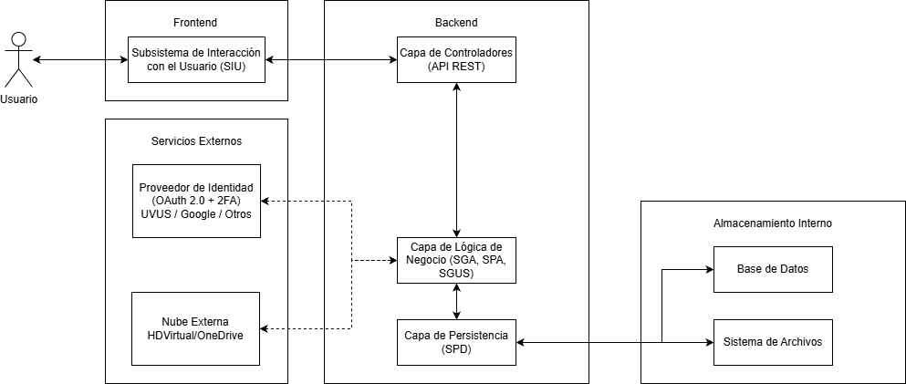

Nuestro sistema software sigue una arquitectura basada en el patron Modelo Vista Controlador (MVC) , disenado bajo un modelo desacoplado que distingue claramente entre el cliente (Frontend) y el servidor (Backend) . Esta separacion permite una mayor flexibilidad tecnologica y facilita la integracion con servicios externos de almacenamiento y una gestion de identidad segura mediante protocolos estandar como OAuth 2.0 . La estructura logica del sistema se divide en los siguientes bloques principales: Frontend (Capa de Presentacion): Esta capa corresponde al Subsistema de Interaccion con el Usuario (SIU) . Es la interfaz grafica responsiva con la que interactuan los usuarios (Alumnos, Profesores y Administradores). Se comunica con el servidor exclusivamente a traves de peticiones HTTP (API REST), asegurando que la logica de negocio no resida en el navegador. Backend (Logica y Control): Actua como el nucleo del sistema alojado en el servidor y orquesta el procesamiento de datos. Se subdivide internamente en tres capas: - Capa de Controladores: Gestiona la entrada de peticiones desde el Frontend y delega las tareas a los subsistemas logicos. - Capa de Logica de Negocio: Implementa las reglas del sistema mediante tres componentes clave: - SGUS (Seguridad): Controla roles y permisos . - SGA (Academica): Gestiona asignaturas, actividades y evaluaciones . - SPA (Archivos): Ejecuta la validacion, renombrado y organizacion automatica de los ficheros entregados . - Capa de Persistencia (SPD): Abstrae el almacenamiento de datos, interactuando tanto con la Base de Datos Relacional (para informacion estructurada) como con el Sistema de Archivos fisico (para los documentos) . Servicios Externos: El sistema se integra con proveedores externos para delegar funcionalidades criticas: - Gestion de Identidad y Acceso (OAuth 2.0 + 2FA): Para la autenticacion, el sistema utiliza el protocolo OAuth 2.0 . Esto permite integrar proveedores de identidad como UVUS o plataformas genericas (Google), reforzando la seguridad mediante Doble Factor de Autenticacion (2FA) . - Almacenamiento en Nube: Se habilita la interoperabilidad con servicios externos (como Nextcloud o OneDrive) para la sincronizacion y respaldo de la jerarquia de carpetas generada por el sistema .

### 2.3 Procesos de negocio: situacion actual y propuesta

#### 2.3.1 Procesos actuales (AS-IS)

- PRON- 001 - Creacion de Tarea en Ensenanza Virtual: El proceso de configuracion de una actividad por parte del profesor sigue el estandar de Moodle: - Acceder a la plataforma : El profesor inicia sesion en Ensenanza Virtual con sus credenciales institucionales (UVUS) y entra en la asignatura. - Activar edicion : El profesor habilita el modo de edicion del curso para poder anadir recursos. - Anadir actividad : Selecciona el modulo "Tarea" dentro del catalogo de actividades disponibles. - Configurar parametros : Define manualmente las fechas de apertura/cierre y restringe los tipos de archivo, pero sin posibilidad de definir una estructura de carpetas de destino. - Guardar y publicar : La tarea queda visible para los alumnos, almacenandose la configuracion en la base de datos de Moodle.
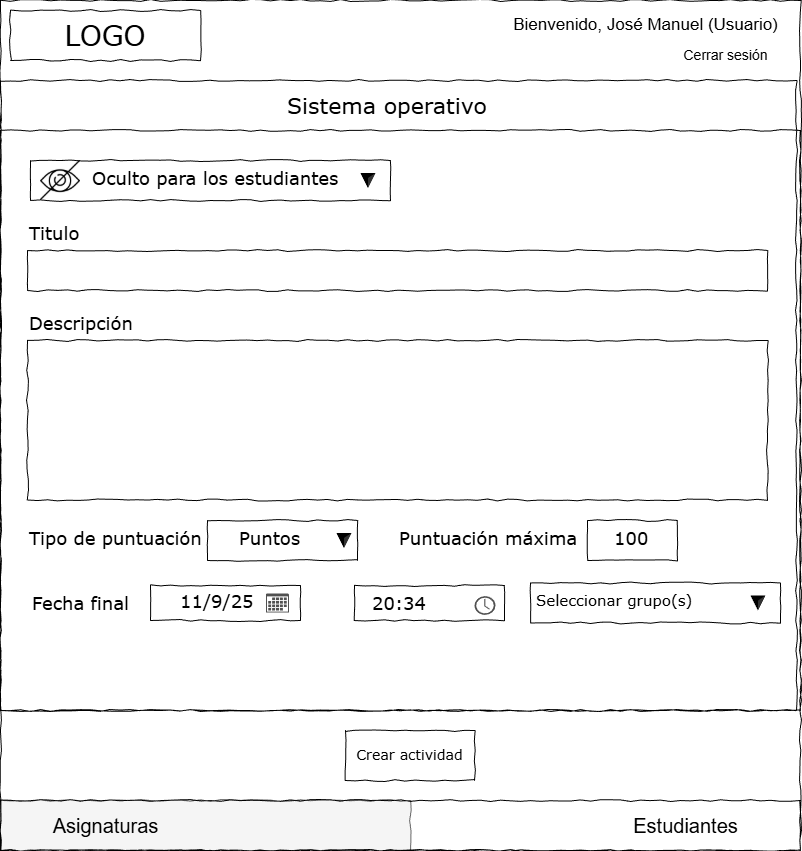

- PRON- 002 - Entrega de Practica (Alumno): El flujo que siguen los estudiantes para subir sus trabajos: - Identificarse y buscar : El alumno se autentica en Ensenanza Virtual y navega hasta encontrar el enlace de la tarea correspondiente. - Subir archivo : El alumno selecciona el fichero de su ordenador y lo carga en la plataforma. - Confirmar envio : El alumno pulsa el boton de enviar para finalizar la entrega. - Almacenamiento opaco : El sistema guarda el archivo en su repositorio interno ("FileStore") con un nombre codificado (hash), sin una estructura de carpetas legible para humanos.
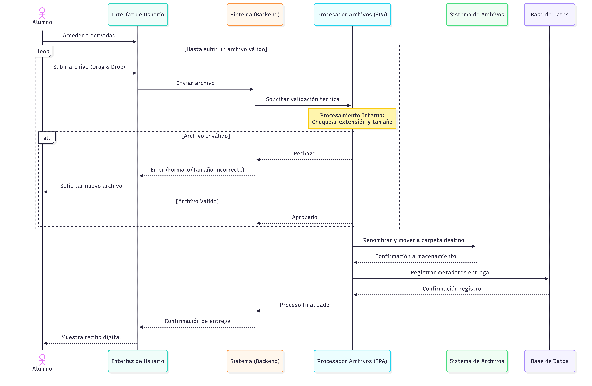

- PRON- 003 - Recogida y Gestion Manual de Entregas: Este es el proceso critico que justifica la necesidad del nuevo sistema, debido a la alta carga manual: - Solicitar descarga : El profesor accede a la tarea y selecciona la opcion "Descargar todas las entregas". - Generar paquete : El sistema comprime todos los archivos de los alumnos en un unico fichero ZIP masivo y lo envia al profesor. - Descomprimir (Manual) : El profesor guarda el ZIP en su equipo y lo extrae. Organizar (Manual) : El profesor debe crear carpetas manualmente, renombrar ficheros mal identificados y clasificarlos por grupos, ya que el ZIP suele venir desestructurado. - Evaluar : Una vez organizado el entorno local, el profesor procede a abrir los trabajos para corregirlos.
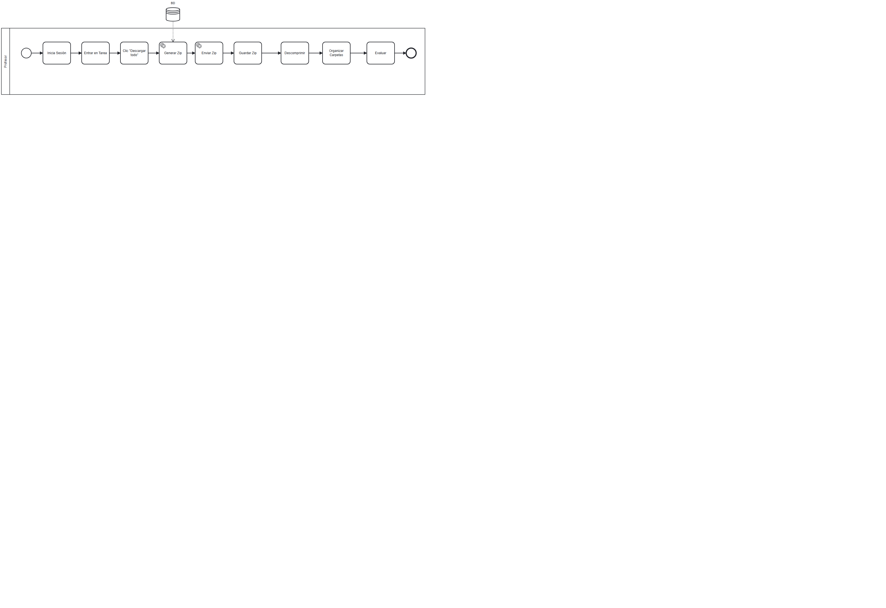

#### 2.3.2 Procesos propuestos (TO-BE)

- PRON-004 - Creacion y Publicacion de Actividad: Este proceso describe como el docente configura una nueva practica. El flujo detallado es el siguiente: - Iniciar sesion y seleccion : El profesor accede a la plataforma con sus credenciales y selecciona la asignatura y el grupo de trabajo sobre el que quiere actuar. - Definir parametros : El profesor introduce los datos de la actividad (titulo, descripcion, fecha limite) y configura las restricciones de archivos (tipo y tamano). - Validar datos : El sistema comprueba automaticamente que las fechas sean coherentes (inicio anterior a fin) y que los campos obligatorios esten rellenos. - Generar estructura : El sistema crea en el servidor la ruta de carpetas jerarquica (Asignatura/Grupo/Actividad) sin intervencion humana. - Publicar y notificar : El sistema hace visible la actividad para los alumnos y envia los avisos correspondientes.

- PRON-005 - Proceso de negocio: Este proceso cubre la subida de entregables, destacando la validacion y organizacion automatica: - Acceder a la actividad : El alumno entra al formulario de entrega mediante el enlace unico proporcionado o navegando desde su panel de usuario. - Cargar entregable : El alumno selecciona el archivo local o introduce el enlace externo requerido en el formulario. - Verificar requisitos : El sistema valida en tiempo real si el archivo cumple con el formato, tamano y si la entrega esta dentro del plazo establecido. - Procesar archivo : Si la validacion es correcta, el sistema renombra el archivo siguiendo el estandar interno y lo mueve a la carpeta correspondiente del alumno. - Confirmar entrega : El sistema registra la fecha y hora en la base de datos y muestra un mensaje de exito al estudiante.Este proceso cubre la subida de entregables. A diferencia del sistema anterior, se realiza una validacion estricta en tiempo real (formato, tamano y nomenclatura) y el archivo se renombra y coloca automaticamente en la carpeta correspondiente al alumno, evitando archivos dispersos.

- PRON-006 - Evaluacion y Feedback: El profesor accede a los trabajos ya organizados para realizar la calificacion: - Listar entregas : El profesor visualiza la lista de estudiantes que han entregado la actividad seleccionada. - Revisar contenido : El profesor accede a los archivos (ya organizados y renombrados) para su correccion y analisis. - Asignar evaluacion : El profesor introduce la calificacion numerica y los comentarios de retroalimentacion en el formulario de evaluacion. - Almacenar y notificar : El sistema guarda los datos de evaluacion, cambia el estado de la entrega a "Calificado" y envia una notificacion al alumno.
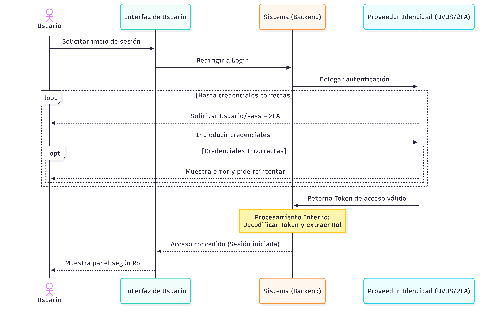

### 2.4 Subsistemas funcionales

- SUBS-001 - **Subsistema de Interaccion con el Usuario (SIU)**: Este subsistema engloba todos los componentes de la capa de presentacion (Frontend). Es el responsable de ofrecer la interfaz grafica a los actores del sistema y de capturar sus interacciones para enviarlas a la logica de negocio. - Portal Web de Acceso : Punto de entrada unico para todos los usuarios. Gestiona el enrutamiento inicial y la presentacion de formularios de login. - Interfaz de Profesorado : Conjunto de vistas que permiten la gestion de asignaturas, la creacion y configuracion de actividades y el panel de evaluacion. - Interfaz de Alumnado : Vistas simplificadas y optimizadas para dispositivos moviles que permiten la consulta de tareas pendientes y la carga de ficheros mediante formularios de subida ("drag & drop").
- SUBS-002 - **Subsistema de Gestion de Usuarios y Seguridad (SGUS)**: Es el encargado de gestionar la identificacion y autorizacion dentro del sistema, garantizando que cada actor acceda unicamente a los recursos permitidos por su rol. - Modulo de Autenticacion : Verifica las credenciales (correo/contrasena) en el inicio de sesion. - Control de Acceso (RBAC) : Gestiona los roles (Profesor, Alumno, Administrador) y aplica las politicas de seguridad (ej. impedir que un alumno modifique una actividad o vea las entregas de otros companeros).
- SUBS-003 - **Subsistema de Gestion Academica (SGA)**: Contiene la logica de negocio principal relacionada con la estructura docente. - Gestion de Estructura : Permite el alta, baja y modificacion de Asignaturas y la creacion de Grupos de practicas. - Gestor de Actividades : Controla el ciclo de vida de las tareas (Abierta, Cerrada, Oculta), gestionando las fechas limite y las reglas de validacion (tipos de archivo permitidos, tamano maximo). - Modulo de Evaluacion : Procesa y almacena las calificaciones y el feedback textual asociado a cada entrega.
- SUBS-004 - **Subsistema de Procesamiento de Archivos (SPA)**: Este es el componente critico que diferencia al sistema de un gestor documental estandar. Se encarga de la manipulacion fisica de los entregables. - Validador de Ficheros : Analiza los metadatos de los archivos subidos para asegurar que cumplen las restricciones definidas en la actividad. - Motor de Organizacion (Renombrado y Movimiento) : Ejecuta la logica de estandarizacion de nombres ( Grupo_Actividad_Alumno.ext ) y la distribucion fisica en la jerarquia de directorios del servidor.
- SUBS-005 - **Subsistema de Persistencia de Datos (SPD)**: Capa transversal encargada del almacenamiento y recuperacion de la informacion. - Base de Datos Relacional : Almacena la informacion estructurada (usuarios, definiciones de actividades, registros de entregas, notas). - Repositorio de Archivos (File System) : Espacio de almacenamiento fisico en disco donde se guardan los documentos organizados jerarquicamente.

### 2.5 Modelo de clases del sistema

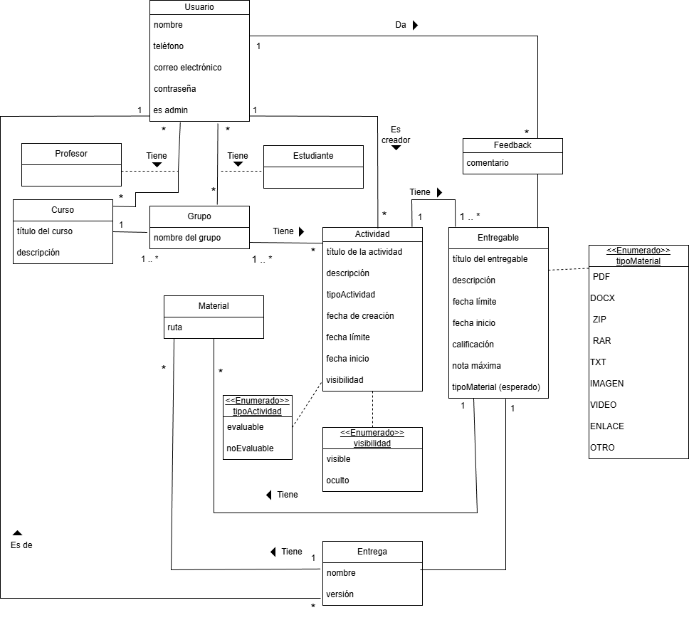

#### 2.5.1 Entidades principales

| Entidad | Codigo | Responsabilidad principal | Atributos relevantes |
|---|---|---|---|
| Usuario | ENT- 001 | Esta clase entidad representa los usuarios de la aplicacion. | nombre, telefono, correo electronico, contrasena, esAdmin |
| Profesor | ENT- 002 | Esta clase entidad representa que usuario es profesor de que curso. | - |
| Estudiante | ENT- 003 | Esta clase entidad representa que usuario es estudiante de que grupo. | - |
| Curso | ENT- 004 | Esta clase entidad representa el curso en el que se encuentran los profesores. | titulo, descripcion |
| Grupo | ENT- 005 | Esta clase entidad representa el grupo de el curso en el que se encuentran los profesores. | titulo |
| Actividad | ENT- 006 | Esta clase entidad representa la actividad que solo podran crear los profesores del curso. | titulo, descripcion, tipoActividad, fechaDeCreacion, fechaLimite, fechaInicio, visibilidad |
| Material | ENT- 007 | Esta clase entidad representa tanto los materiales de ayuda que puede aportar el profesor tanto en actividades como entregables y estudiantes cuando realiza una entrega. | tipoMaterial, ruta |
| Entregable | ENT- 008 | Esta clase entidad representa los subapartados de las actividades. | titulo, descripcion, fechaLimite, fechaInicio, notaMaxima, calificacion, tipoDeArchivoEsperado |
| Entrega | ENT- 009 | Esta clase entidad representa la entrega que realiza un alumno a un entregable. | nombre, version |
| Feedback | ENT- 010 | Esta clase entidad representa los mensajes que realiza un profesor a un entregable que realizo un profesor. | comentario |

### 2.6 Modelo de estados

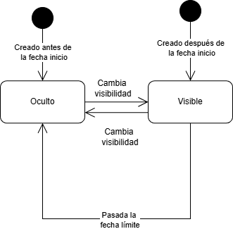

El modelo de estados de actividad formaliza transiciones clave (creacion, publicacion, ocultacion, cierre) y facilita validar reglas temporales de entrega y visibilidad para cada rol.

### 2.7 Interacciones dinamicas (diagramas de secuencia)

#### Crear Actividad

#### Realizar Entrega

#### Autenticacion y Acceso

#### Evaluacion y Feedback

A continuacion se describen los flujos de interaccion principales representados en los diagramas anteriores, correspondientes a los procesos criticos del negocio: - Creacion de Actividad: Este diagrama modela la interaccion mediante la cual el profesor configura una nueva tarea academica. El proceso incluye un bucle de validacion en el Backend que impide avanzar si las fechas son incoherentes o faltan datos obligatorios. Una vez validados los datos, el sistema orquesta la creacion fisica de la estructura de directorios en el servidor antes de confirmar el registro en la base de datos . - Realizacion de Entrega: Representa el proceso critico de subida de archivos por parte del alumno. El diagrama destaca el papel del Subsistema de Procesamiento de Archivos (SPA) , que actua dentro de un bucle de interaccion validando en tiempo real los requisitos tecnicos (extension, tamano, virus). Solo cuando el archivo supera estas validaciones, el sistema procede a su renombrado automatico y almacenamiento definitivo . - Autenticacion y Acceso: Muestra el flujo de seguridad externalizado. El usuario interactua repetidamente con el proveedor de identidad (UVUS/OAuth) hasta verificar correctamente sus credenciales y superar el Doble Factor de Autenticacion (2FA) . Tras el exito, el sistema recibe un token seguro que le permite identificar el rol del usuario y concederle acceso al panel correspondiente . - Evaluacion y Feedback: Describe el flujo de trabajo del profesor para calificar. El sistema recupera el archivo previamente organizado y, tras la introduccion de la nota y los comentarios por parte del docente, se encarga de persistir la informacion y generar una notificacion asincrona para informar al estudiante de su nueva calificacion .

### 2.8 Interfaz de servicios (operaciones del sistema)

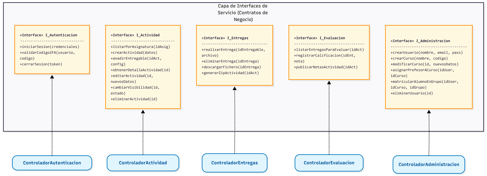

| Codigo | Operacion | Descripcion | Precondicion | Postcondicion |
|---|---|---|---|---|
| SYSOP-001 | iniciarSesion | Esta operacion inicia el proceso de autenticacion validando las credenciales contra el directorio institucional (UVUS). Si son correctas, solicita el segundo factor. | - No haber iniciado sesion previamente | - Si las credenciales son validas, el sistema queda a la espera del codigo 2FA - Si no, devuelve error de autenticacion |
| SYSOP-002 | validarCodigo2FA | Esta operacion completa el inicio de sesion verificando el codigo temporal proporcionado. Genera el token de sesion final con los roles asociados. | - Haber superado la validacion de credenciales (SYSOP-001) - El codigo no debe haber expirado | - Generacion de token JWT de sesion - Redireccion al panel principal segun el rol (Alumno/Profesor) |
| SYSOP-003 | cerrarSesion | Invalida el token de sesion actual del usuario, impidiendo futuras peticiones hasta que se vuelva a autenticar. Es fundamental por seguridad. | - Tener una sesion activa | - Elimina la sesion del almacenamiento temporal (lista negra de tokens o expiracion) - Redirige a la pantalla de login |
| SYSOP-004 | listarActividades | Devuelve el listado de actividades de una asignatura. Si quien consulta es alumno, solo devuelve las visibles. Si es profesor, devuelve todas. | - Estar autenticado y matriculado/asignado a la asignatura | - Lista filtrada segun el rol del usuario solicitante |
| SYSOP-005 | crearActividad | Esta operacion permite a un profesor definir una nueva actividad en una asignatura. Adicionalmente, permite adjuntar una lista de archivos de referencia (guias, plantillas) para que los alumnos los descarguen. | - Estar autenticado como Profesor - La fecha de inicio debe ser anterior a la fecha limite | - Crea la Actividad en estado "Borrador" (Oculta). - Redirige a la pantalla de detalles de la actividad para poder anadirle entregables |
| SYSOP-006 | anadirEntregable | Define un requisito de entrega dentro de una actividad. Aqui se especifican las restricciones tecnicas (formato y peso) para el alumno. Ejemplo: Un entregable "Memoria PDF" y otro "Codigo ZIP". | - Usuario PROFESOR propietario de la actividad. - La actividad debe existir. | - Crea un "hueco" de entrega (Entregable) asociado a la actividad. - Configura las reglas de validacion que usara el SPA. |
| SYSOP-007 | obtenerPorId | Recupera toda la informacion de una actividad especifica para mostrarla en pantalla. | - El usuario debe estar autenticado. - LOGICA DE ACCESO: - a) Si es PROFESOR: Debe tener permisos sobre la asignatura (independientemente del estado). - b) Si es ALUMNO: Debe estar matriculado Y la actividad debe tener 'visible = true'. | - Retorna el objeto con: Datos generales, Enlaces a material adjunto y Estado de la entrega del alumno (si aplica). |
| SYSOP-008 | Editar Actividad | Permite modificar los datos de una actividad existente. Es necesario validar que la nueva fecha de inicio no sea posterior a la de fin y que, si la actividad ya tiene entregas, no se cambien condiciones criticas. | - Estar autenticado como Profesor - Ser el propietario de la actividad - La nueva fechaInicio < nueva fechaLimite | - Actualiza los datos en la base de datos - Si se anaden nuevos archivos al material adjunto, los sube y vincula |
| SYSOP-009 | cambiarVisibilidad | Esta operacion cambia el estado de una actividad para hacerla visible u oculta para los alumnos matriculados. | - Estar autenticado como Profesor - Ser el propietario de la actividad | - Actualiza el estado de visibilidad en la base de datos |
| SYSOP-010 | realizarEntrega | El alumno sube un archivo para cumplir con un ENTREGABLE especifico. | - Usuario ALUMNO matriculado. - La Actividad contenedora debe estar VISIBLE y en PLAZO. - VALIDACION TECNICA: El archivo debe coincidir con los 'formatosPermitidos' y 'pesoMaximo' definidos en el SYSOP-006 para este entregable. | - Archivo renombrado y guardado fisicamente. - Se registra la entrega vinculandola al alumno y al entregable concreto. |
| SYSOP-011 | eliminarActividad | Elimina una actividad del sistema. RESTRICCION DE SEGURIDAD: - Si existen entregas de alumnos (ficheros) pero NO estan calificadas, el sistema permite el borrado en cascada (elimina actividad y ficheros). - Si existen calificaciones o feedback registrado, el sistema BLOQUEA la operacion para proteger la integridad de las notas. | - Estar autenticado como Profesor - Ser propietario de la actividad - La actividad debe existir - NO tener calificaciones ni feedback registrados en el sistema (Integridad Academica) | - Elimina todos los registros de entregas (archivos) de los alumnos. - Ordena al SPA (Sistema de Archivos) borrar fisicamente la carpeta de la actividad. - Elimina el registro de la actividad de la base de datos. |
| SYSOP-012 | eliminarEntrega | Permite al alumno eliminar su entrega si se ha equivocado. | - El usuario debe ser el autor de la entrega. - La actividad asociada debe seguir abierta (en plazo). - La entrega NO debe haber sido calificada por el profesor. | - Se marca el registro como eliminado o se borra fisicamente. - El estado de la entrega del alumno vuelve a "Pendiente". |
| SYSOP-013 | descargarFichero | Permite la descarga de un fichero especifico (ya sea una entrega de un alumno o un material adjunto del profesor). El sistema verifica que el usuario tenga permisos para ver ese archivo concreto. | - Estar autenticado - Si es alumno: ser el autor de la entrega o que sea material publico - Si es profesor: tener acceso al curso | - Devuelve el flujo de bytes del archivo solicitado |
| SYSOP-014 | generarZipActividad | Genera un archivo comprimido (ZIP) que contiene todas las entregas realizadas para una actividad especifica, facilitando la correccion offline. | - Estar autenticado como Profesor - Existir entregas asociadas a la actividad | - Devuelve un flujo de bytes correspondiente al archivo ZIP generado |
| SYSOP-015 | listarEntregasParaEvaluar | Proporciona al profesor el listado de alumnos y el estado de sus entregas. | - Usuario PROFESOR con acceso a la asignatura. | - Devuelve una lista con: Datos del alumno, Fecha de entrega (o indicacion de "No entregado"), Estado de correccion (Pendiente/Calificado) y Nota actual. |
| SYSOP-016 | registrarCalificacion | Permite al profesor asignar una calificacion numerica y un comentario de feedback a una entrega especifica. | - Usuario PROFESOR. - La entrega debe existir en el sistema. - El valor de la nota debe estar dentro del rango permitido por la configuracion de la asignatura. | - Se actualiza el registro de la entrega con la nota y la fecha de correccion. - El estado interno cambia a 'Calificado' (pero no necesariamente visible para el alumno). |
| SYSOP-017 | publicarNotasActividad | Hace visibles las notas y comentarios para todos los alumnos de una actividad. | - Usuario PROFESOR. - Deben existir calificaciones registradas en estado "Borrador/Oculto". | - Todas las calificaciones asociadas a la actividad cambian de estado a 'PUBLICADO'. - Los alumnos pueden ver sus notas y feedback a traves de SYSOP-007. - Se dispara un evento de notificacion (email/push) a los alumnos afectados. |
| SYSOP-018 | crearUsuario | Permite al administrador dar de alta manualmente a un nuevo usuario cuando no se usa el alta automatica por OAuth/Google. | - Estar autenticado con rol de ADMINISTRADOR. - El email no debe existir previamente en la base de datos. | - Se crea el registro de identidad en la base de datos. |
| SYSOP-019 | crearCurso | Crea una asignatura o curso en el sistema. Permite la posterior creacion de grupos y asignacion de personal docente. | - Estar autenticado como ADMINISTRADOR. - El codigo del curso debe ser unico. | - Registra la nueva asignatura en la base de datos. |
| SYSOP-020 | modificarCurso | Permite al administrador modificar los datos identificativos de un curso existente, como su nombre o su codigo de referencia. | - Estar autenticado como ADMINISTRADOR. - El curso debe existir. - El nuevo codigo, si se cambia, no debe estar en uso por otro curso. | - Actualiza los metadatos del curso en la base de datos. |
| SYSOP-021 | asignarProfesorACurso | Vincula a un usuario con un curso bajo el rol de PROFESOR. Esto le otorga permisos de edicion y evaluacion sobre todas las actividades y entregables de dicho curso. Un mismo usuario puede ser asignado como profesor aqui aunque sea alumno en otros cursos. | - Estar autenticado como ADMINISTRADOR. - El usuario y el curso deben existir. | - Crea una relacion de docencia en la base de datos para este contexto especifico. |
| SYSOP-022 | matricularAlumnoEnGrupo | Vincula a un usuario con un curso bajo el rol de ALUMNO. La matricula requiere obligatoriamente la asignacion a un grupo especifico. Un mismo usuario puede matricularse como alumno aqui aunque sea profesor en otros cursos. | - Estar autenticado como ADMINISTRADOR. - El usuario, el curso y el grupo deben existir. | - Crea una relacion de matricula vinculada al grupo seleccionado en este curso. |
| SYSOP-023 | eliminarUsuario | Elimina al usuario del sistema, lo que provoca la revocacion automatica de todas sus matriculas y asignaciones docentes en todos los contextos. | - Estar autenticado como ADMINISTRADOR. | - Se eliminan los registros de identidad y todas sus vinculaciones como alumno o profesor. |

### 2.9 Casos de uso del sistema

#### 2.9.1 Catalogo de casos de uso

| Codigo | Caso de uso | Precondicion resumida | Postcondicion resumida |
|---|---|---|---|
| CU- 001 | Gestion de actividades | - Estar registrado como profesor. | La actividad queda registrada y asociada a un curso. |
| CU- 002 | Edicion de actividad | - Ser profesor responsable del curso. | Se actualizan los datos de la actividad. |
| CU- 003 | Eliminacion de actividad | - Ser profesor responsable. - Ser administrador. | Se elimina la actividad y sus entregables asociados. |
| CU- 004 | Mostrar/Ocultar actividad | -Ser profesor de la actividad. | El alumno puede consultar la actividad y sus detalles. |
| CU- 005 | Autenticacion y Acceso | Ninguna (Tener credenciales validas). | El usuario obtiene un token de sesion valido y accede a su panel principal. |
| CU- 006 | Creacion de usuarios | - Ser administrador | Se crea un usuario. |
| CU- 007 | Edicion de usuarios | - Ser administrador | Se modifica el usuario especificado. |
| CU- 008 | Eliminacion de usuario | - Ser administrador. | Se elimina el usuario. |
| CU- 009 | Creacion de feedback | - Estar registrado como profesor. - Existir un entregable asociado. | El sistema almacena el comentario y la fecha de emision asociados al entregable. |
| CU- 010 | Edicion de feedback | - Ser el profesor que emitio el feedback. - Existir el feedback en el sistema. | Se actualizan los comentarios del feedback en la base de datos. |
| CU- 011 | Eliminacion de feedback | - Ser el profesor que emitio el feedback. - Existir el feedback en el sistema. | El feedback se elimina del sistema. |
| CU- 012 | Consulta de feedback | - Estar registrado como alumno y ser autor del entregable asociado. - Estar registrado como profesor responsable del curso. | El alumno podra consultar el feedback recibido sobre sus entregables. |
| CU- 013 | Creacion de entregable | Estar registrado como profesor y que exista la actividad. | El entregable queda asociado a la actividad. |
| CU- 014 | Edicion de entregable | Estar registrado como profesor, que exista la actividad y que exista el entregable. | el entregable queda actualizado. |
| CU- 015 | Eliminacion de entregable | Estar registrado como profesor, que exista la actividad y que exista el entregable. | El entregable se elimina. |
| CU- 016 | Realizacion de entregable | - Ser un alumno - Estar asignado al grupo del entregable | Se guarda la entrega en onedrive para su revision. |
| CU- 017 | Creacion de curso | - Ser administrador | Se crea el curso. |
| CU- 018 | Modificacion de curso | - Ser administrador - Que exista el curso referenciado | Se modifica el curso. |
| CU- 019 | Realizacion de calificacion | Estar registrado como profesor responsable del curso. | Se registran calificaciones y comentarios asociados al entregable. |

#### 2.9.2 Diagramas de casos de uso (galeria)

**Creacion de actividades**

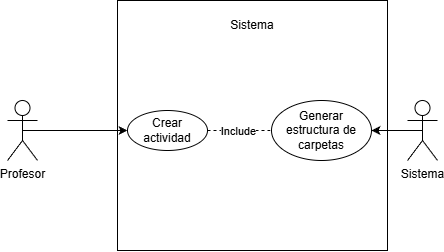

**Edicion de actividades**

**Eliminacion de actividades**

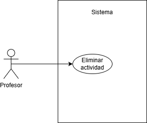

**Mostrar/Ocultar actividad**

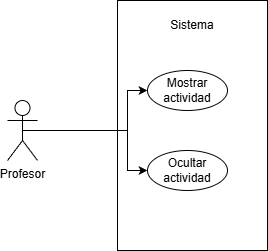

**Inicio de sesion**

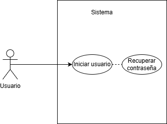

**Creacion de usuarios**

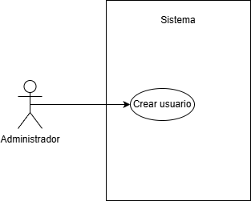

**Edicion de usuario**

**Eliminacion de usuarios**

**Emision de feedback**

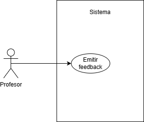

**Edicion de feedback**

**Eliminacion de feedback**

**Consulta de feedback**

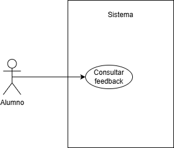

**Creacion de entregables**

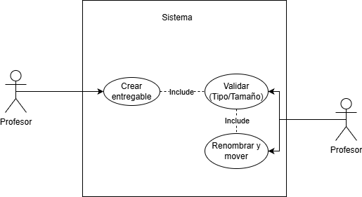

**Edicion de entregable**

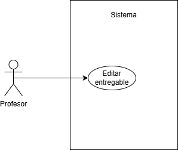

**Eliminacion de entregable**

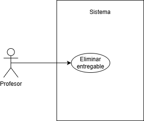

**Realizacion de entrega**

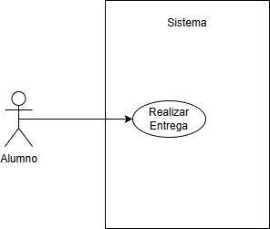

**Creacion de curso**

**Modificacion de cursos**

**Realizacion de calificacion**

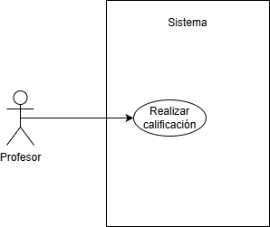

### 2.10 Interfaz de usuario: navegabilidad y mockups

#### 2.10.1 Diagrama de navegabilidad

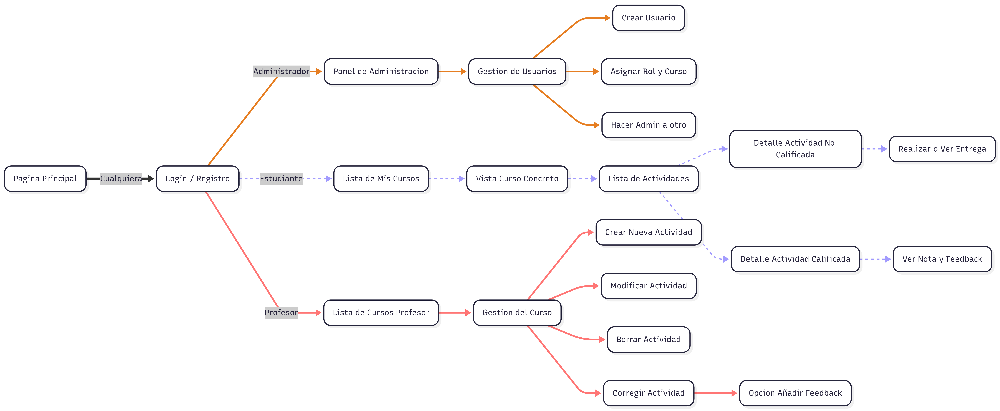

#### 2.10.2 Mockups funcionales

**Mockup 1: Mock up 1**

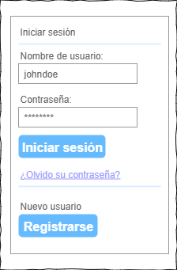

- Mock up 1: Inicio de sesion, donde debes poner tu nombre de usuario y contrasena para acceder. Tambien puedes ir a la pagina de registro

**Mockup 2: Mock up 2**

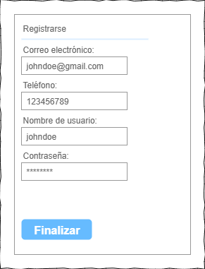

- Mock up 2: Pagina de registro, donde debes completar formulario poniendo nombre, correo, telefono y contrasena.

**Mockup 3: Mock up 3**

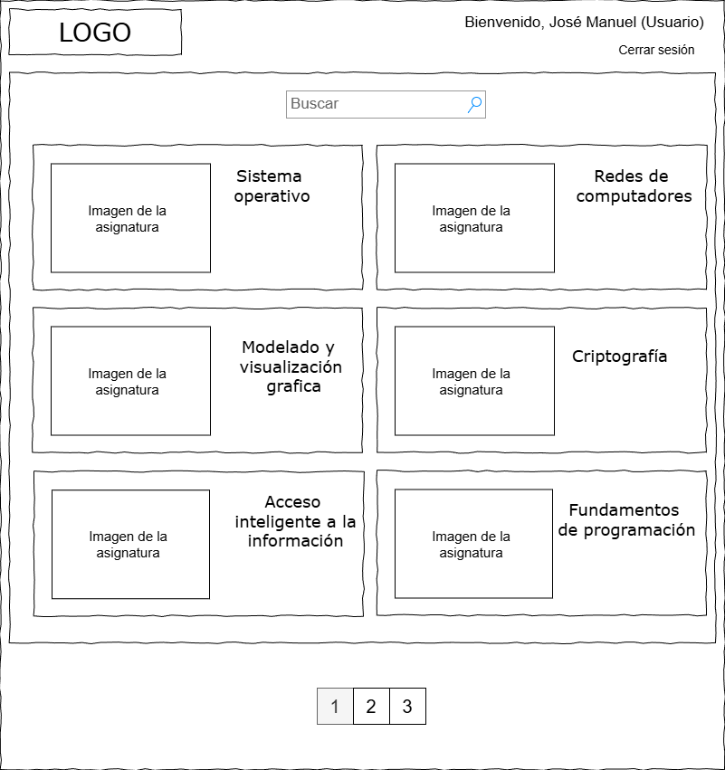

- Mock up 3: En esta vista, los estudiantes podran ver en que cursos se encuentran, pudiendo seleccionar uno para obtener mas detalles de los mismos.

**Mockup 4: Mock up 4**

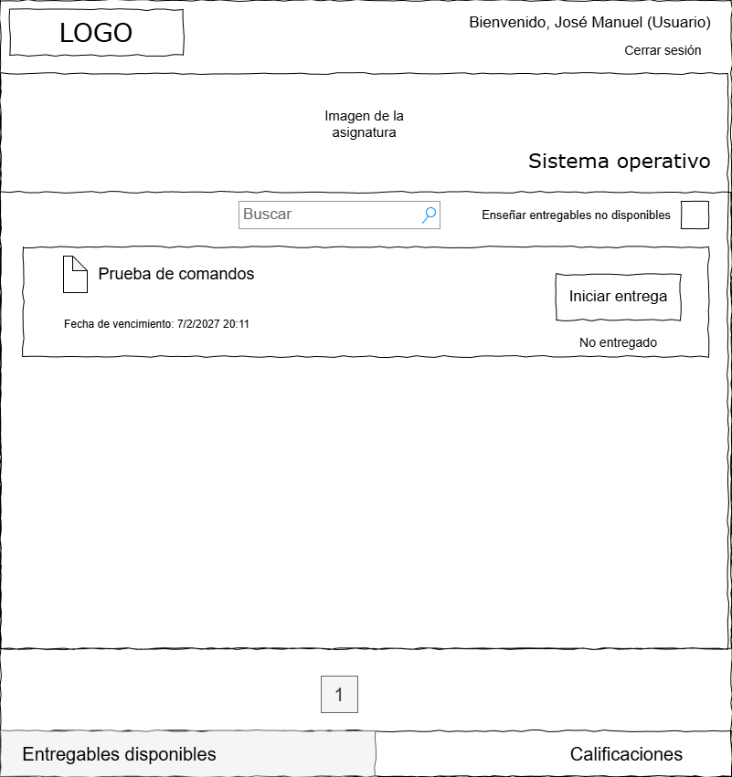

- Mock up 4: En esta vista se ve como veria los entregables un estudiante dentro de la asignatura. Ademas de poder cambiar a otra vista para ver las calificaciones del curso.

**Mockup 5: Mock up 5**

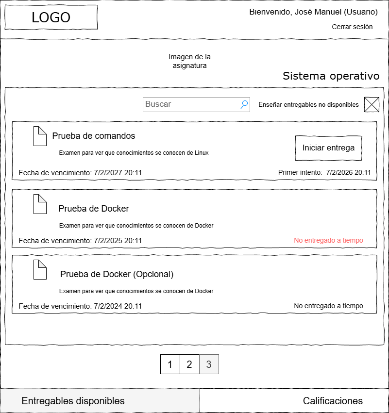

- Mock up 5: En esta vista se ve como veria los entregables un estudiante dentro de la asignatura habiendo seleccionado que se quieren ver los entregables que no entrego a tiempo. Ademas de poder cambiar a otra vista para ver las calificaciones del curso.

**Mockup 6: Mock up 6**

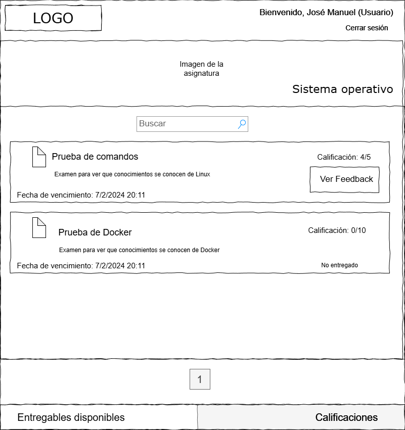

- Mock up 6: En esta vista el estudiante puede ver la calificacion conseguida de cada actividad, pudiendo entrar a cada una en caso de que se quiera ver el feedback.

**Mockup 7: Mock up 7**

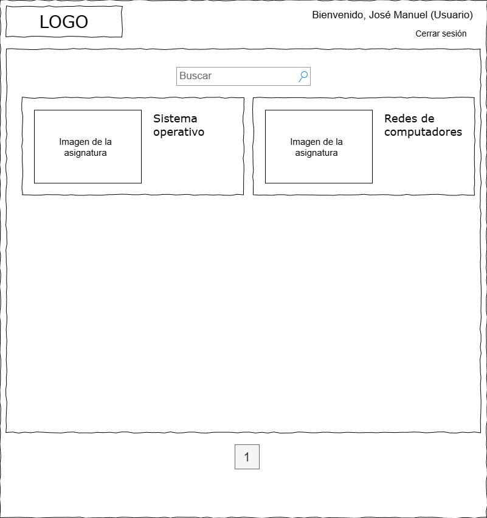

- Mock up 7: En esta vista se ensena como veria la aplicacion el profesor nada mas loguearse, pudiendo meterse en cada curso.

**Mockup 8: Mock up 8**

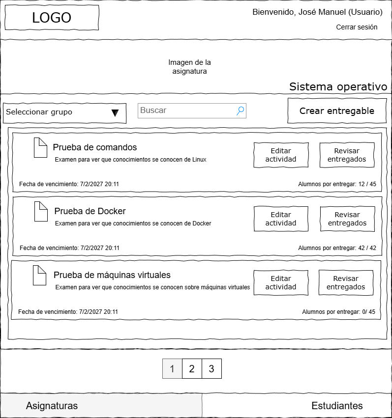

- Mock up 8: En esta vista se ve un curso desde la vista de un profesor, esto permite ver que numero de alumnos han entregado ya la asignatura, permite ir a editar las actividades o ver las entregas de los alumnos. Ademas de tener la posibilidad de filtrar los entregables por grupo

**Mockup 9: Mock up 9**

- Mock up 9: En esta vista se puede crear una actividad, eligiendo si se quiere que sea oculto o visible, poner el titulo del mismo, establecer una descripcion, poner como se va a ver la puntuacion de la entrega, la nota maxima que se puede sacar, establecer la fecha limite que se puede entregar y por ultimo seleccionar los grupos a los que se quiere poner la actividad.

**Mockup 10: Mock up 10**

- Mock up 10: En esta vista se puede modificar una actividad, eligiendo si se quiere que sea oculto o visible, poner el titulo del mismo, establecer una descripcion, poner como se va a ver la puntuacion de la entrega, la nota maxima que se puede sacar, establecer la fecha limite que se puede entregar y por ultimo seleccionar los grupos a los que se quiere poner la actividad. Ademas de poder elminarse, saliendo una alerta de confirmacion.

**Mockup 11: Mock up 11**

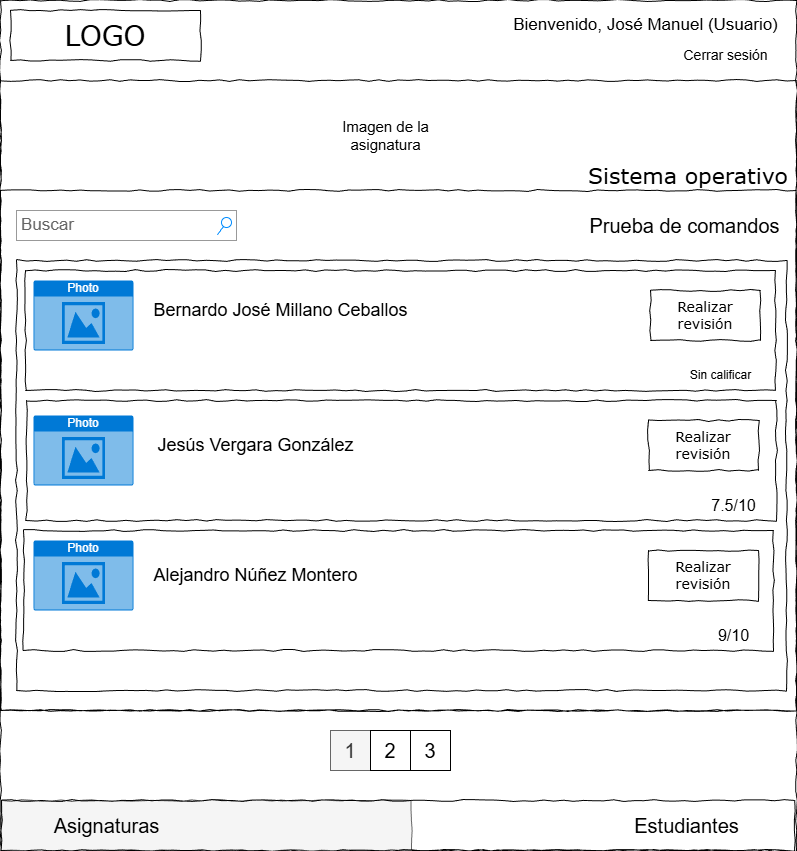

- Mock up 11: En esta vista, el profesor puede seleccionar un estudiante para calificarlo ademas de ponerle feedback en caso de que lo vea necesario de un entregable seleccionado con anterioridad.

**Mockup 12: Mock up 12**

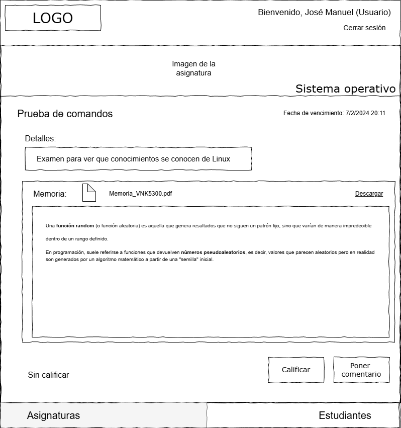

- Mock up 12: En esta vista un profesor puede tanto asignar una calificacion por entregable al estudiante como ponerle feedback.

**Mockup 13: Mock up 13**

- Mock up 13: En esta vista se ve como se veria la entrega de un estudiante nada mas abrirla.

**Mockup 14: Mock up 14**

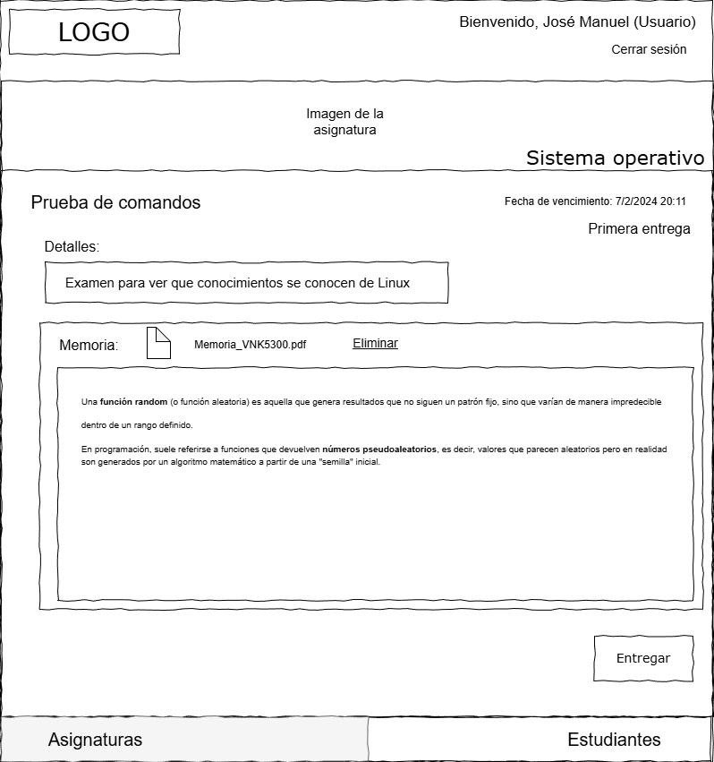

- Mock up 14: En esta vista se ve como se veria la entrega de un estudiante poniendo el elemento a entregar viendo una previsualizacion del mismo, ademas de poder eliminar el archivo entregado en caso de fallo.

**Mockup 15: Mock up 15**

- Mock up 15: En esta vista se puede ver como el profesor puede poner feedbacl al estudiante.

**Mockup 16: Mock up 16**

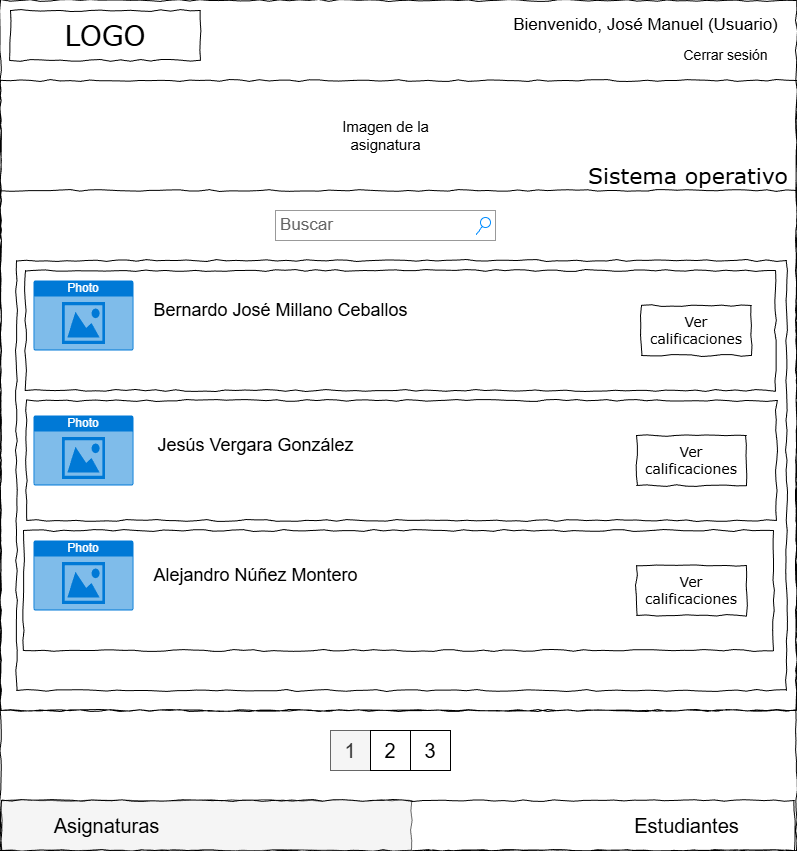

- Mock up 16: En esta vista puede ver el profesor las clasificaciones sacadas de un alumno en la asignatura.

### 2.11 Requisitos generales

| Codigo | Requisito general | Descripcion |
|---|---|---|
| RQG- 001 | Gestion de usuarios y roles | El sistema debera permitir la gestion de usuarios diferenciando los roles de profesor, alumno y administrador, permitiendo que todos los usuarios puedan iniciar sesion. La creacion y eliminacion de usuarios sera responsabilidad exclusiva del administrador, y el sistema debera asociar permisos especificos a cada rol, garantizando que las acciones disponibles se ajusten a las funciones correspondientes de cada usuario. El sistema debera asociar permisos especificos a cada rol: Profesores: crear y gestionar actividades y entregables. Alumnos: acceder y entregar en los entregables visibles. Administrador: gestionar permisos, usuarios y configuracion global. |
| RQG- 002 | Gestion de actividades y entregables | El sistema debera permitir a los profesores crear actividades , clasificadas como evaluables o no evaluables . Cada actividad podra dividirse en subapartados o entregables , cada uno con sus propios requisitos (fecha limite, descripcion, tipo de archivo esperado, criterios de evaluacion). Los profesores podran marcar cada entregable como visible u oculto para los alumnos , y ademas podran proporcionar material de apoyo en distintos formatos , como enlaces a repositorios de GitHub , archivos PDF u otros, tanto a nivel de entregable como de subapartado . |
| RQG- 003 | Acceso de los alumnos a entregables | Los alumnos deberan poder visualizar unicamente los entregables que no esten ocultos . Ademas, el sistema debera permitir que los alumnos suban sus entregas (archivos, enlaces o texto) dentro del plazo definido , registrando automaticamente la fecha y hora de cada entrega. |
| RQG- 004 | Gestion de versiones y reenvios | El sistema debera permitir a los profesores crear actividades clasificadas como evaluables o no evaluables , las cuales podran dividirse en subapartados o entregables , cada uno con sus propios requisitos como fecha limite, descripcion, tipo de archivo esperado y criterios de evaluacion. Ademas, los profesores podran marcar cada entregable como visible u oculto para los alumnos , garantizando asi un control adecuado sobre la informacion que se presenta. |
| RQG- 005 | Gestion de actividades y entregables | El sistema debera permitir a los alumnos reenviar entregables siempre que el profesor lo habilite, y debera mantener un historial de versiones de cada entrega , indicando claramente cual es la version valida para evaluacion . |
| RQG- 006 | Comunicacion y feedback | El sistema debera incluir un canal de feedback en cada entregable , donde el profesor pueda brindar retroalimentacion al alumno y asignar calificaciones correspondientes. Los alumnos deberan poder consultar los comentarios de los profesores y responder a ellos, mientras que el profesor podra marcar cuales entregables han sido evaluados y registrar la nota final de cada alumno . |
| RQG- 007 | Seguridad y control de acceso | El sistema debera garantizar que cada alumno solo pueda entregar en sus propios entregables . Ademas, toda la informacion sensible como contrasenas , calificaciones y comentarios privados debera estar encriptada para proteger la privacidad y la integridad de los datos. |

### 2.12 Requisitos funcionales

| Codigo | Requisito funcional | Descripcion |
|---|---|---|
| RQF- 001 | Crear usuarios | El sistema debera permitir a un administrador crear un nuevo perfil donde facilite los datos del usuario para asignarle el rol de profesor o alumno |
| RQF- 002 | Iniciar sesion | El sistema debera permitir que los usuarios inicien sesion en la aplicacion |
| RQF- 003 | Editar usuarios | El sistema debera permitir la modificacion de datos personales (en caso de que sea administrador) o contrasena (en caso de que sea el usuario) |
| RQF- 004 | Eliminar usuarios | El sistema debera permitir eliminar usuarios en caso de ser el administrador. |
| RQF- 005 | Crear actividades | El sistema debera permitir la creacion de actividades. |
| RQF- 006 | Visibilizar actividades | El sistema debera permitir a los profesores hacer visibles o no las actividades a sus estudiantes. |
| RQF- 007 | Proporcionar archivos adjuntos | El sistema debera permitir a los profesores dar por cada entregable o actividad y por cada subapartado de los mismos ficheros adjuntos para apoyar al alumno en la tarea. |
| RQF- 008 | Modificar actividades | El sistema debera permitir modificar actividades creadas por el profesor que la creo. |
| RQF- 009 | Eliminar actividades | El sistema debera permitir a los profesores la eliminacion de las actividades creadas por ellos. |
| RQF- 010 | Ver actividades | El sistema debera permitir ver las actividades ya sea para la correccion o por los alumnos para ver las actividades corregidas o por hacer. |
| RQF- 011 | Crear entregables | El sistema debera permitir a los profesores crear entregables |
| RQF- 012 | Modificar entregables | El sistema debera permitir la modificacion de entregables por parte del profesor que la creo. |
| RQF- 013 | Eliminar entregable | El sistema debera la eliminacion de entregables por parte del profesor que la creo. |
| RQF- 014 | Realizar entrega | El sistema debera permitir a los estudiantes realizar la entrega permitiendo subir archivos por apartado o de la propia entrega. |
| RQF- 015 | Enviar actividades | El sistema debera permitir a los estudiantes enviar la actividad. |
| RQF- 016 | Gestionar version de entregables | El sistema debera almacenar versiones de los entregables en caso de que el estudiante haya hecho mas de una. |
| RQF- 017 | Gestionar version de actividades | El sistema debera mantener la version de las resoluciones de las actividades enviadas por el alumno. |
| RQF- 018 | Dar feedback | El sistema debera permitir a los profesores y estudiantes comunicarse entre ellos cuando el profesor haya puesto la calificacion al alumno. |
| RQF- 019 | Realizar calificacion | El sistema debera permitir al profesor asignar una calificacion a una actividad o entregable realizada por un alumno. |
| RQF- 020 | Ver entregables | El sistema debera permitir a los alumnos y profesores ver las versiones entregadas que se han dado en las actividades y entregables. |
| RQF- 021 | Crear curso | El sistema debera permitir a los administradores crear cursos. |
| RQF- 022 | Modificar curso | El sistema debera permitir a los administradores modificar los cursos. |
| RQF- 023 | Ver lo que ve un estudiante | El sistema debera permitir a los profesores un modo para ver que pueden visualizar los estudiantes. |
| RQF- 024 | Visibilizar entregable | El sistema debera permitir a los profesores hacer visibles o no los entregables a sus estudiantes. |
| RQF- 025 | Integracion del almacenamiento en la nube | El sistema debera utilizar los respectivos servicios de almacenamiento en la nube segun el metodo seleccionado. |

### 2.13 Requisitos de informacion

- RQI- 001 - Informacion sobre actividades: Titulo de la actividad, Descripcion, Tipo de actividad, Fecha de creacion, Fecha limite, Fecha inicio, Profesor, Visibilidad, Calificacion total, Materiales asociados, Curso
- RQI- 002 - Informacion sobre entregables: Titulo del entregable, Descripcion, Fecha limite, Fecha inicio, Copia de Calificacion total, Materiales asociados, Tipo de archivo esperado, Calificacion
- RQI- 003 - Informacion de usuarios: Nombre, Correo electronico, Rol, Contrasena, Telefono
- RQI- 004 - Informacion de cursos: Titulo del curso, Profesores, Alumnos, Descripcion
- RQI- 005 - Informacion de feedback: Entregable, Profesor, Comentario

### 2.14 Reglas de negocio

| Codigo | Regla | Descripcion |
|---|---|---|
| REGN- 001 | Correccion de entregables | El sistema debera respetar la siguiente regla de negocio o restriccion: Solo el profesor asignado al entregable puede establecer una nota. |
| REGN- 002 | Ver entregables | El sistema debera respetar la siguiente regla de negocio o restriccion: Los alumnos solo pueden ver las versiones de los entregables creados por ellos. |
| REGN- 003 | Correccion de actividades | El sistema debera respetar la siguiente regla de negocio o restriccion: Solo el profesor asignado a la actividad puede establecer una nota. |
| REGN- 004 | Ver actividades | El sistema debera respetar la siguiente regla de negocio o restriccion: Los alumnos solo pueden ver las versiones de las actividades hechas por ellos. |
| REGN- 005 | Fecha limite de entrega | El sistema debera respetar la siguiente regla de negocio o restriccion: Los estudiantes no pueden entregar actividades o entregables pasado el plazo limite de los mismos. |
| REGN- 006 | Denegar permisos a recursos no visibles | El sistema debera respetar la siguiente regla de negocio o restriccion: El alumno no puede interactuar con recursos no visibles. |
| REGN- 007 | Creacion de entregables y actividades | El sistema debera respetar la siguiente regla de negocio o restriccion: Los profesores son los unicos que pueden crear actividades y entregables. |
| REGN- 008 | Feedback | El sistema debera respetar la siguiente regla de negocio o restriccion: Solo el profesor asignado podra dar feedback a un entregable. |

### 2.15 Requisitos no funcionales y restricciones tecnicas

| Codigo | Tipo | Requisito | Descripcion |
|---|---|---|---|
| RQNF- 001 | RNF | Tolerancia a fallos | El sistema debera guardar los cambios (feedback, entregables, etc) en local hasta que el servidor pueda guardarlo para evitar la perdida de datos debido a fallos de conexion. |
| RQNF- 002 | RNF | Intuitividad | El sistema sera intuitivo, siguiendo un modelo comun de herramientas parecidas para facilitar la interaccion de nuevos usuarios. |
| RQNF- 003 | RNF | Uniformidad | La interfaz del sistema sera cohesiva con la marca corporativa del cliente. Todas las fuentes, colores e imagenes usadas seran aceptadas por el cliente. |
| RQNF- 004 | RNF | Acoplamiento bajo | El sistema debera tener las relaciones estrictamente necesarias entre modulos, reduciendo al minimo el acoplamiento para facilitar el mantenimiento de la aplicacion. |
| RQNF- 005 | RNF | Cohesion alta | El sistema debera tener una alta cohesion para facilitar el mantenimiento del sistema. |
| RQNF- 006 | RNF | Tiempo de carga | En condiciones optimas, el sistema debera tardar menos de 2 segundos para llevar al usuario a las vistas pertinentes. |
| RQNF- 007 | RNF | Tiempo de busqueda | En condiciones optimas, el sistema debera responder a las peticiones en un maximo de 0,5 milisegundos realizando las busquedas pedidas en la base de datos ademas de evitar busquedas redundantes |
| RQNF- 008 | RNF | Navegadores | El sistema debera ser compatible con los navegadores mas usuales. |
| RQNF- 009 | RNF | Inicio de sesion | El sistema mostrara solo aquella informacion disponible al usuario registrado. |
| RQNF- 010 | RNF | Encriptacion | El sistema debera mantendra encriptado toda la informacion personal y/o sensible. |
| RQNF- 011 | Restriccion tecnica | Compatibilidad con versiones de navegadores | El sistema debera ser compatible con los navegadores Google Chrome version 109 o superior, Mozilla Firefox version 108 o superior y Microsoft Edge version 109 o superior, tanto en sus versiones de escritorio como moviles. |

### 2.16 Trazabilidad y coherencia documental

La trazabilidad se apoya en matrices entre requisitos generales, casos de uso, requisitos de informacion, reglas de negocio y requisitos funcionales. En terminos de cohesion de memoria, esto permite justificar cada decision de diseno (DAS) con su necesidad funcional (ERS) y viceversa. Para la defensa del TFG, se recomienda mantener esta seccion sincronizada en cada sprint para evitar divergencias entre implementacion y documentacion.

Matrices consideradas en la documentacion:
- MATR-001: casos de uso vs requisitos generales.
- MATR-002: requisitos de informacion vs requisitos generales.
- MATR-003: reglas de negocio vs requisitos generales.
- MATR-004: requisitos funcionales vs requisitos generales.
- MATR-005: operaciones del sistema vs requisitos funcionales.

### 2.17 Cierre del capitulo

Con esta integracion, los capitulos 1 y 2 quedan alineados con DAS y ERS, incorporando no solo texto descriptivo sino evidencia visual (diagramas y mockups), definicion de alcance, arquitectura, modelo de datos, catalogo de requisitos, casos de uso y operaciones de sistema. Esto deja preparada la transicion natural hacia los capitulos de implementacion, validacion y resultados experimentales de la memoria.
